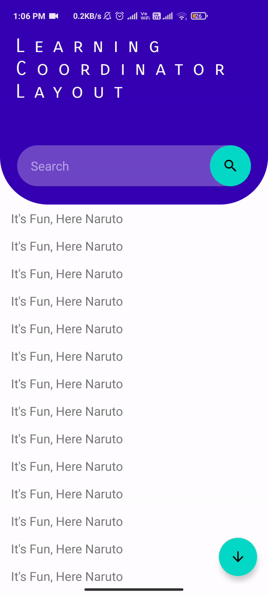
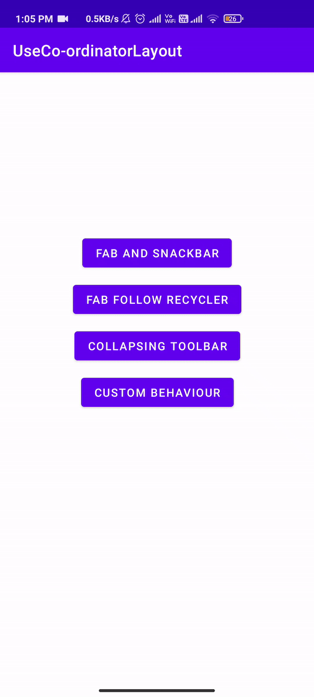
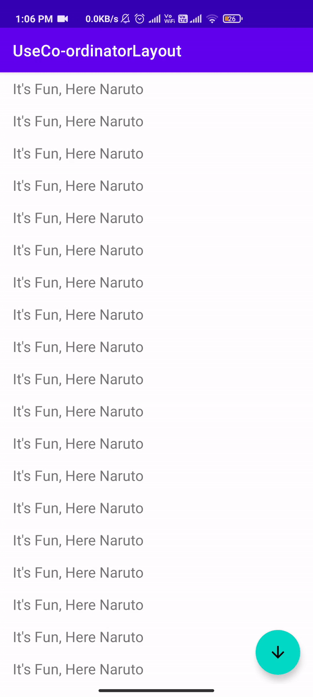

# Use Co-Ordinator-Layout
In this project I have created stages in which we can create a specific type of Co-Ordinator layout    
There are 4 ways in which we can use Co Ordinator Layout, And I used each way to create custom behaviour for Floating Action Button.
> 1. Floating Action Button with Snack Bar
> 2. FLoasting Action Button anchor with Recyler View and Behaviour
> 3. Collapsing Toolbar with Floating Action Behaviour
> 4. Collapsing Toolbar with Custom Behaviour  <--- final stage

### This is how final stage will look.

Notice Floating action button (FAB) When Snack bar Appears and when it goes. Even FAB will disappear when we scroll down and reappear when we scroll up.

This behaviour in our CustomBehaviour.java using CustomScrollFabBehaviour.java from Utils Package

 ### 1. Floating Action Button with Snack Bar 
 
 
 Here we implement Snack Bar with Floating Action Button, All it we have to do is Code in XML and we just have to add Listner in our java code.    
 This is implemented in the following [JAVA Code](https://github.com/DonutsDevil/Use-Co-Ordinator-Layout/blob/main/Source%20code/java/useco_ordinatorlayout/FabAndSnackBar.java) and [XML Code](https://github.com/DonutsDevil/Use-Co-Ordinator-Layout/blob/main/Source%20code/res/layout/activity_fab_and_snack_bar.xml)
  

### 2. FLoasting Action Button anchor with Recyler View and Behaviour


Here we anchor our FAB with Recycler View and add a Behaviour to it i.e when we scroll down FAB will disappear and when scroll up FAB will reappear   
We need a **Recycler View** for it, Creating *LinearLayoutManager and Adapter* is done in its [Utils class](https://github.com/DonutsDevil/Use-Co-Ordinator-Layout/blob/main/Source%20code/java/useco_ordinatorlayout/Utils/RecyclerUtils.java) since we will be needed it Often.   
This is implemented in the following [Java code](https://github.com/DonutsDevil/Use-Co-Ordinator-Layout/blob/main/Source%20code/java/useco_ordinatorlayout/FabFollowWidget.java) , [XML Code](https://github.com/DonutsDevil/Use-Co-Ordinator-Layout/blob/main/Source%20code/res/layout/activity_fab_follow_widget.xml)
```
// Add this line in your fab or else Scroll behaviour will not work
app:layout_behavior=".Utils.ScrollAwareFABBehaviour"
```
Since here we need our FAB to Appear and disapear when we Scroll up and down we Creat [ScrollAwareFABBehaviour.java](https://github.com/DonutsDevil/Use-Co-Ordinator-Layout/blob/main/Source%20code/java/useco_ordinatorlayout/Utils/ScrollAwareFABBehaviour.java)

## Common Attributes for next 2 Stage
 In themes we need to add a ***No Action Bar Theme*** Since we will Cretae our own Toolbar and in **Manifet** we need to Declare our theme for specific Acitvity.    
 We also need to add a style to make our title invisibe when collapsing view is expanded    
[Themes.xml](https://github.com/DonutsDevil/Use-Co-Ordinator-Layout/blob/main/Source%20code/res/values/themes.xml)
```
<style name="collapsingTollbarStyle" parent="Theme.MaterialComponents.DayNight.NoActionBar">
        <item name="colorPrimary">@color/purple_500</item>
        <item name="colorPrimaryVariant">@color/purple_700</item>
        <item name="colorOnPrimary">@color/white</item>
    </style>
    
    <!-- UseCoordinatorLayout is the base theme for the app-->
 <style name="CollapsingToolbarLayoutExpandedTextStyle" parent="Theme.UseCoordinatorLayout">
        <item name="android:textColor">@android:color/transparent</item>
        <item name="android:textSize">0sp</item>
 </style>
```
[Manifest](https://github.com/DonutsDevil/Use-Co-Ordinator-Layout/blob/main/Source%20code/AndroidManifest.xml)
```
Mainifet
<activity  android:name=".CollapsingToolbar"
            android:theme="@style/collapsingTollbarStyle" />
 
 <activity android:name=".CustomBehaviour"
            android:theme="@style/collapsingTollbarStyle"/>
```  


### 3. Collapsing Toolbar with Floating Action Behaviour


Here we Create Collapsing Toolbar Layout, with the same fab behaviour as of **Stage 2**, But here we need to edit some code in our ***[Manifest](https://github.com/DonutsDevil/Use-Co-Ordinator-Layout/blob/main/Source%20code/AndroidManifest.xml)*** and  ***[Themes.xml](https://github.com/DonutsDevil/Use-Co-Ordinator-Layout/blob/main/Source%20code/res/values/themes.xml)***

This is implemented in [CollapsingToolbar.java](https://github.com/DonutsDevil/Use-Co-Ordinator-Layout/blob/main/Source%20code/java/useco_ordinatorlayout/CollapsingToolbar.java) , [activity_collapsing_toolbar.xml](https://github.com/DonutsDevil/Use-Co-Ordinator-Layout/blob/main/Source%20code/res/layout/activity_collapsing_toolbar.xml)
and [ScrollAwareFABBehaviour.java](https://github.com/DonutsDevil/Use-Co-Ordinator-Layout/blob/main/Source%20code/java/useco_ordinatorlayout/Utils/ScrollAwareFABBehaviour.java)

### 4. Collapsing Toolbar with Custom Behaviour  --- Final stage


This is our **Final Stage** Where we make our FAB Image to Depend on SnackBar Visibilty and Invisibilty, As we notice FAB image chamges to up arrow when click and after a while it changes to down arrow when snack bar is gone.    
It need ***No Action Bar Theme*** and needs to be declare in ***Manifest*** as done for *Stage 3*    
Here we will change our ****FAB Behaviour**** With our Custom [Behaviour](https://github.com/DonutsDevil/Use-Co-Ordinator-Layout/blob/main/Source%20code/java/useco_ordinatorlayout/Utils/CustomScrollFabBehaviour.java) and also change our FAB layout behaviour in
[activity_custom_behaviour.xml](https://github.com/DonutsDevil/Use-Co-Ordinator-Layout/blob/main/Source%20code/res/layout/activity_custom_behaviour.xml) to the one we created
```
app:layout_behavior=".Utils.CustomScrollFabBehaviour"
```
In Java side we just need to implement our Recyler VIew and initialize our Views [CustomBehaviour.java](https://github.com/DonutsDevil/Use-Co-Ordinator-Layout/blob/main/Source%20code/java/useco_ordinatorlayout/CustomBehaviour.java)

